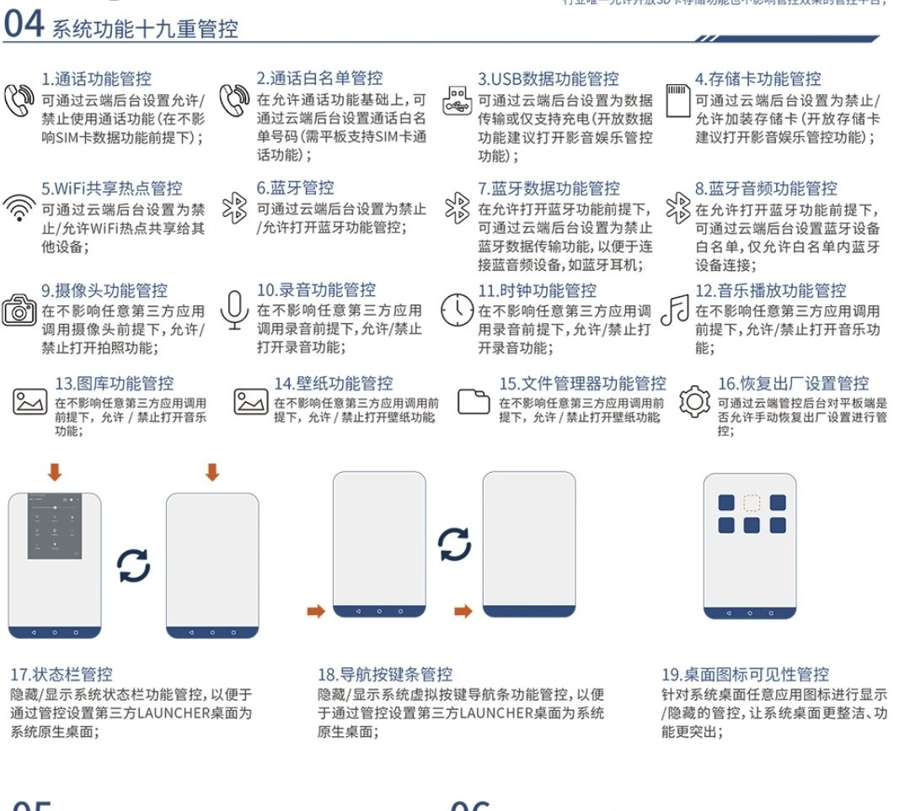
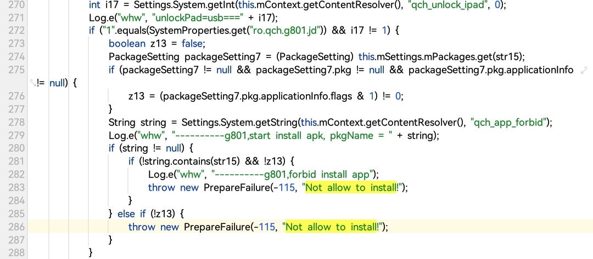
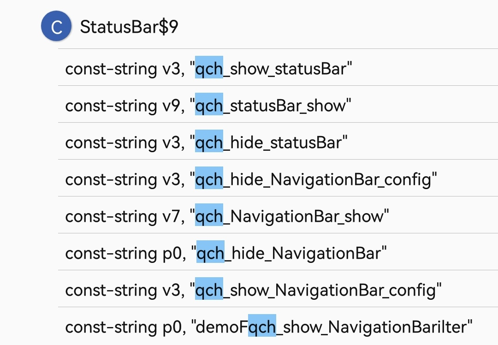

[七彩虹官网](www.colorfulyun.cn)


这个公司自称拥有多种管控措施，例如

那么这个系统到底有多~~牛逼~~呢（），让我们一起看看这个所谓的"管控系统"到底是什么吧

前情提要:
废了很大的劲把adb搞开了（多亏了我的改版Magisk）并且搞定了usb授权
这款平板限制了安装，会提示not allow to install！

那么就先从安装限制入手吧

### 一.安装限制分析
直接来/system/framework/services.jar搜报错not allow to install
可以看到如下代码

我们先看最外面的这层if吧
如果prop ro.qch.g801.jd为1或者settings system项qch_unlock_ipad≠1才会触发安装校验，那么直接破坏这两个条件即可

继续看里面的if，如果settings system项qch_app_forbid不包含这个应用的包名 那么就拦截安装

这个qch什么意思呢？qi cai hong拼音缩写qch()

那么qch_unlock_ipad和qch_app_forbid等是什么时候设置的呢🤔我们来继续分析吧

### 二.Launcher分析
真的，我研究了好久从来没有怀疑过launcher
我们直接看代码吧，刚看到onResume就没绷住


wanghuiwen同学你好呀😋  
这里用到了一个settings system项always_top_packagename，作用是打开指定app


以下是startActivitySafely的分析
```
// 读取settings systek配置
String disallowList = Settings.System.getString(
    getContentResolver(), "qch_jgy_network_disallow"
);
String allowList = Settings.System.getString(
    getContentResolver(), "qch_jgy_network_allow"
);

String targetPackage = intent.getComponent().getPackageName();

//黑名单拦截
if (disallowList != null && disallowList.contains(targetPackage)) {
    Settings.System.putString(getContentResolver(), targetPackage, "no");
    sendBroadcast(new Intent("qch_jgy_network_disallow")); //发送广播，意义不明
    Toast.makeText(this, "应用已被禁止使用", Toast.LENGTH_SHORT).show();
    return true;
}

//白名单放行
if (allowList != null && allowList.contains(targetPackage)) {
    Settings.System.putString(getContentResolver(), targetPackage, "yes");
    sendBroadcast(new Intent("qch_jgy_network_allow"));
}
```
剩下这堆代码我懒得评价了，自己看吧
```
        try {
            if (!SystemProperties.get("ro.qch.g801.jd").equals("1")) {
                meida_mounteds = meida_mounteds2;
            } else {
                String str = intent.toString();
                StringBuilder sb = new StringBuilder();
                meida_mounteds = meida_mounteds2;
                try {
                    sb.append("intent-launcher-wang-str-=");
                    sb.append(str);
                    Log.e("wanghuiwen", sb.toString());
                    if (str.contains("/")) {
                        str = str.substring(SCRIM_VIEW_ALPHA_CHANNEL_INDEX, str.indexOf("/"));
                    }
                    Log.e("wanghuiwen", "intent-launcher-wang-str222-=" + str);
                    if (str.contains("SET_WALLPAPER")) {
                        if (Settings.System.getInt(getApplicationContext().getContentResolver(), "qch_app_wallpaper", SCRIM_VIEW_ALPHA_CHANNEL_INDEX) == 1) {
                            Toast.makeText(getApplicationContext(), "壁纸选择已被禁止使用，请联系管理员！", SCRIM_VIEW_ALPHA_CHANNEL_INDEX).show();
                            return true;
                        }
                    } else {
                        String userIdJiequ = str.substring(str.indexOf("cmp=")).replace("cmp=", "");
                        Log.e("wanghuiwen", "intent-launcher-wang-userIdJiequ-=" + userIdJiequ);
                        Log.e("wanghuiwen", "intent-launcher-wang-userIdJiequ-xxxxx---=" + Settings.System.getString(getApplicationContext().getContentResolver(), userIdJiequ));
                        StringBuilder sb2 = new StringBuilder();
                        sb2.append("intent-launcher-wang-userIdJiequ-yyyy--==");
                        sb2.append(Settings.System.getInt(getApplicationContext().getContentResolver(), userIdJiequ + "reboots", SCRIM_VIEW_ALPHA_CHANNEL_INDEX));
                        Log.e("wanghuiwen", sb2.toString());
                        if (qch_jgy_network_disallow != null && qch_jgy_network_disallow.contains(userIdJiequ)) {
                            if (Settings.System.getString(getApplicationContext().getContentResolver(), userIdJiequ) != null && Settings.System.getString(getApplicationContext().getContentResolver(), userIdJiequ).equals("no")) {
                                if (Settings.System.getInt(getApplicationContext().getContentResolver(), userIdJiequ + "reboots", SCRIM_VIEW_ALPHA_CHANNEL_INDEX) == 1) {
                                    Log.e("wanghuiwen", "intent-launcher-wang-nononononono=noting");
                                }
                            }
                            Intent intentrr = new Intent();
                            intentrr.setAction("qch_jgy_network_disallow");
                            intentrr.putExtra("package_name", userIdJiequ);
                            intentrr.setPackage("com.android.settings");
                            sendBroadcast(intentrr);
                            Settings.System.putString(getApplicationContext().getContentResolver(), userIdJiequ, "no");
                            Log.e("wanghuiwen", "intent-launcher-wang-nononononono=" + qch_jgy_network_disallow);
                            Settings.System.putInt(getApplicationContext().getContentResolver(), userIdJiequ + "reboots", 1);
                        }
                        if (qch_jgy_network_allow != null && qch_jgy_network_allow.contains(userIdJiequ)) {
                            if (Settings.System.getString(getApplicationContext().getContentResolver(), userIdJiequ) != null && Settings.System.getString(getApplicationContext().getContentResolver(), userIdJiequ).equals("yes")) {
                                if (Settings.System.getInt(getApplicationContext().getContentResolver(), userIdJiequ + "reboots", SCRIM_VIEW_ALPHA_CHANNEL_INDEX) == 0) {
                                    Log.e("wanghuiwen", "intent-launcher-wang-yesyeysyesyes=noting");
                                }
                            }
                            Log.e("wanghuiwen", "intent-launcher-wang-yessyesyyesyeys=" + qch_jgy_network_allow);
                            Intent intentss = new Intent();
                            intentss.setAction("qch_jgy_network_allow");
                            intentss.putExtra("package_name", userIdJiequ);
                            intentss.setPackage("com.android.settings");
                            sendBroadcast(intentss);
                            Settings.System.putString(getApplicationContext().getContentResolver(), userIdJiequ, "yes");
                            Settings.System.putInt(getApplicationContext().getContentResolver(), userIdJiequ + "reboots", SCRIM_VIEW_ALPHA_CHANNEL_INDEX);
                        }
                    }
                } catch (ActivityNotFoundException e) {
                    Toast.makeText((Context) this, R.string.activity_not_found, SCRIM_VIEW_ALPHA_CHANNEL_INDEX).show();
                    try {
                        if (SystemProperties.get("ro.qch.g801.jd").equals("1")) {
                        }
                    } catch (ActivityNotFoundException e2) {
                    }
                    if (success) {
                    }
                    return success;
                }
            }
        } catch (ActivityNotFoundException e3) {
            meida_mounteds = meida_mounteds2;
        }
        try {
            if (SystemProperties.get("ro.qch.g801.jd").equals("1")) {
                success = super.startActivitySafely(v, intent, item, sourceContainer);
            } else {
                StringBuilder sb3 = new StringBuilder();
                sb3.append("intent-launcher-wang--=");
                try {
                    sb3.append(intent);
                    Log.e("wanghuiwen", sb3.toString());
                    if (intent.toString().contains("com.android.deskclock")) {
                        try {
                            if (Settings.System.getInt(getApplicationContext().getContentResolver(), "qch_app_deskclock", SCRIM_VIEW_ALPHA_CHANNEL_INDEX) == 1) {
                                Toast.makeText(getApplicationContext(), "出于封闭需要，时钟已被禁止使用！", SCRIM_VIEW_ALPHA_CHANNEL_INDEX).show();
                                return true;
                            }
                        } catch (ActivityNotFoundException e4) {
                            Toast.makeText((Context) this, R.string.activity_not_found, SCRIM_VIEW_ALPHA_CHANNEL_INDEX).show();
                            success = SCRIM_VIEW_ALPHA_CHANNEL_INDEX;
                            if (success) {
                            }
                            return success;
                        }
                    }
                    if (intent.toString().contains("com.android.soundrecorder") && Settings.System.getInt(getApplicationContext().getContentResolver(), "qch_app_soundrecorder", SCRIM_VIEW_ALPHA_CHANNEL_INDEX) == 1) {
                        Toast.makeText(getApplicationContext(), "出于封闭需要，录音机已被禁止使用！", SCRIM_VIEW_ALPHA_CHANNEL_INDEX).show();
                        return true;
                    }
                    if (intent.toString().contains("com.android.music") && Settings.System.getInt(getApplicationContext().getContentResolver(), "qch_app_music", SCRIM_VIEW_ALPHA_CHANNEL_INDEX) == 1) {
                        Toast.makeText(getApplicationContext(), "出于封闭需要，音乐已被禁止使用！", SCRIM_VIEW_ALPHA_CHANNEL_INDEX).show();
                        return true;
                    }
                    CharSequence charSequence3 = charSequence2;
                    if (intent.toString().contains(charSequence3) && Settings.System.getInt(getApplicationContext().getContentResolver(), "qch_app_gallery", SCRIM_VIEW_ALPHA_CHANNEL_INDEX) == 1) {
                        Toast.makeText(getApplicationContext(), "出于封闭需要，图库或视频已被禁止使用！", SCRIM_VIEW_ALPHA_CHANNEL_INDEX).show();
                        return true;
                    }
                    CharSequence charSequence4 = charSequence;
                    if (intent.toString().contains(charSequence4) && Settings.System.getInt(getApplicationContext().getContentResolver(), "qch_app_filemanager", SCRIM_VIEW_ALPHA_CHANNEL_INDEX) == 1) {
                        Toast.makeText(getApplicationContext(), "出于封闭需要，文件管理器已被禁止使用！", SCRIM_VIEW_ALPHA_CHANNEL_INDEX).show();
                        return true;
                    }
                    if (!intent.toString().contains("com.android.browser") || Settings.System.getInt(getApplicationContext().getContentResolver(), "qch_app_browser", SCRIM_VIEW_ALPHA_CHANNEL_INDEX) != 1) {
                        if (Settings.System.getString(getApplicationContext().getContentResolver(), "jgy_CAMERA_forbid") != null && Settings.System.getString(getApplicationContext().getContentResolver(), "jgy_CAMERA_forbid").equals("close")) {
                            if (intent.toString().contains("com.android.camera2")) {
                                Toast.makeText(getApplicationContext(), "出于封闭需要，照相机已被禁止使用！", SCRIM_VIEW_ALPHA_CHANNEL_INDEX).show();
                                return true;
                            }
                            success = super.startActivitySafely(v, intent, item, sourceContainer);
                        } else {
                            if (tfmedia_forbid == 1 && meida_mounteds == 1) {
                                Log.e("wanghuiwen", "intent-launcher-wang-ExistSDCard()-=" + checkSDCardAvailable());
                                if (!intent.toString().contains(charSequence3) && !intent.toString().contains("com.android.music") && !intent.toString().contains(charSequence4)) {
                                    success = super.startActivitySafely(v, intent, item, sourceContainer);
                                }
                                Toast.makeText(getApplicationContext(), "出于封闭需要，检测到sd卡有音视频文件，已被禁止使用！", SCRIM_VIEW_ALPHA_CHANNEL_INDEX).show();
                                return true;
                            }
                            success = super.startActivitySafely(v, intent, item, sourceContainer);
                        }
                    } else {
                        Toast.makeText(getApplicationContext(), "出于封闭需要，浏览器已被禁止使用！", SCRIM_VIEW_ALPHA_CHANNEL_INDEX).show();
                        return true;
                    }
                } catch (ActivityNotFoundException e5) {
                    Toast.makeText((Context) this, R.string.activity_not_found, SCRIM_VIEW_ALPHA_CHANNEL_INDEX).show();
                    success = SCRIM_VIEW_ALPHA_CHANNEL_INDEX;
                    if (success) {
                        BubbleTextView btv = (BubbleTextView) v;
                        btv.setStayPressed(true);
                        addOnResumeCallback(btv);
                    }
                    return success;
                }
            }
        } catch (ActivityNotFoundException e6) {
        }
        if (success && (v instanceof BubbleTextView)) {
            BubbleTextView btv2 = (BubbleTextView) v;
            btv2.setStayPressed(true);
            addOnResumeCallback(btv2);
        }
        return success;
    }

```
这就是七彩虹所谓的**管控系统**  ，~~原来管控系统就是一堆Settings get啊~~难绷

总结一下就是:ro.qch.g801.jd为0绕过全部限制

### 三.三大金刚键分析
虽然说修改ro.qch.g801.jd能解除绝大部分限制，但是还是有很多限制是存在的，例如三大金刚键  
就目前来说 虽然安装限制 输入法限制等之类的狗屁限制解除了，三大金刚键依然是个大问题  
想返回byd还得重启，~~气笑了~~  

我们已经知道了这个管控系统就是一堆以qch_开头的settings项，那么直接来SystemUI搜qch吧

好家伙，一来就看到个qch_hide_NavigationBar_config，分析一下
```
        if ("qch_hide_NavigationBar_config".equals(action)) {
            if (defaultNavigationBarView == null) {
                return;
            }
            this.this$0.mNavigationBarController.removeNavigationBarView();
            Settings.System.putString(context.getContentResolver(), "qch_NavigationBar_show", "hide");
            Log.e("wanghuiwen", "qch_hide_NavigationBar");
            return;
        }
```
这里会设置qch_NavigationBar_show为hide，我们用adb shell settings get看一下设备上到底是不是hide

看（）果然是hide，但是貌似并不是改成show就行了这么简单，这个show只是标记，实际由广播控制  
我这里偷懒，懒得改SystemUI了，直接adb发广播吧  
```
adb shell am broadcast -a qch_show_NavigationBar_config -p com.android.systemui
```
写到sh里面，扔到data adb service.d systemui.sh，可以开机执行
```
#!/system/bin/sh
while true; do
    boot_completed=$(getprop sys.boot_completed)
    if [ "$boot_completed" == "1" ]; then
        break
    fi
    sleep 5
done
am broadcast -a qch_show_NavigationBar_config -p com.android.systemui

for i in 1 2; do
    sleep 5
    am broadcast -a qch_show_NavigationBar_config -p com.android.systemui
done
```
**对这个平板的研究就先到这里啦，总结一下一下就是，这个七彩虹做的系统简直就是~~一坨狗屎~~**  
所谓管控系统，原来只是一堆Settings项啊